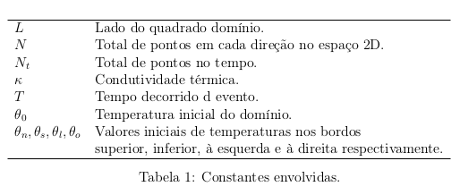
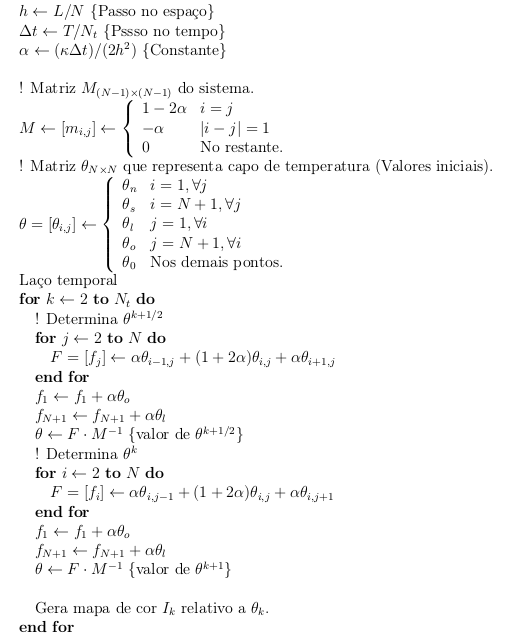
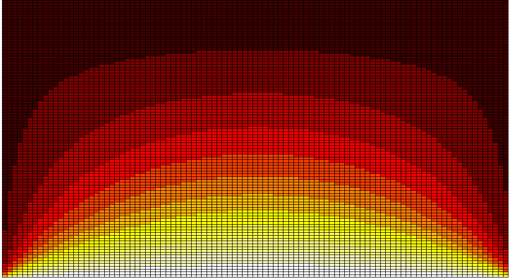
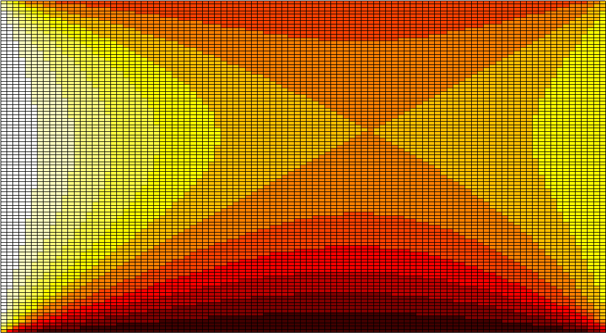

## The content shown in this work can be better explained on the above paper, article.pdf. Basically, there are codes for the resolutions of differential equations made in C++ and Octave(MATLAB), a linguage onwer for the resolutions of cientifics math works. The codes do a simulation of the distribution and transmission of heat in a metal board as of fourier equation. The analysis was done in one and two dimensions, in one dimension was observed the steady state when the derivative is zero, and in two dimesion was observed the transient state when the derivative varies. The result of the tests was satisfactory.

### OBS: basic understanding of linear algebra, differential equations, finite difference method and algorithms is necessary to understand the work.

### Tools

* C

* Octave

### Knowledges

* Linear Algebra

* Differential Equantions
	* Fourier Equation

* Numerical Analysis
	* Finite Difference Method
	* Boundary Conditions of Dirichlet
	* Crank-Nicolson Method

* Algorithms 

### Description code of the algorithm in two dimensions

#### Parameters

#### Algorithm

### Results: Below the results will be shown

#### 1D: In the steady state, we expect the result below, because we have differentiation in only one direction, so the gradient propagates in one direction.

#### 1D: In the steady state, we expect the result below, because we have differentiation in all directions, so the gradient propagates in all directions.

#### 2D: In the transient state, we expect the result below, because we have differential and we are analyzing with time variation.

